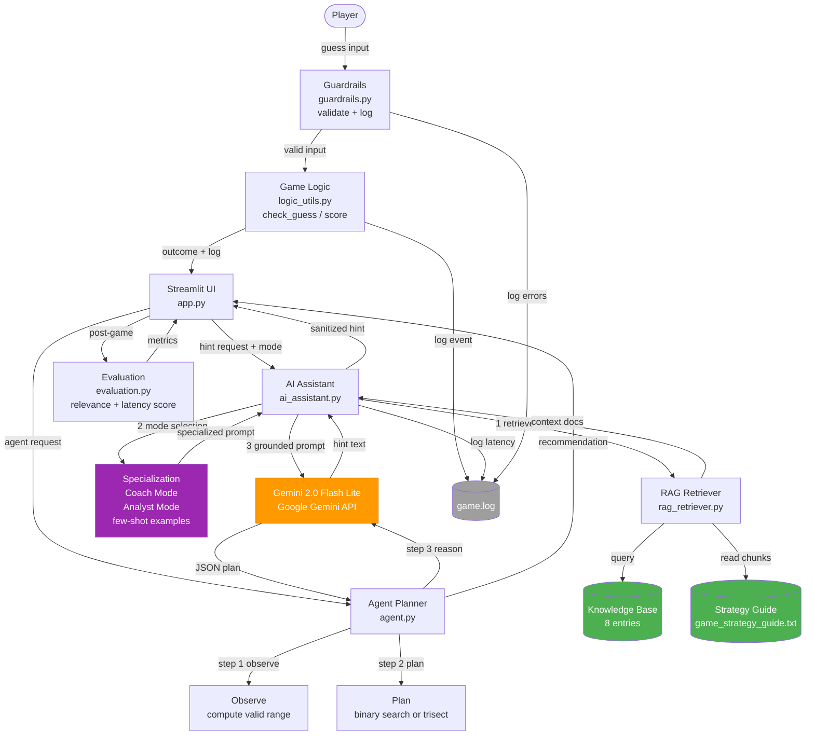

# Game Glitch Investigator: Applied AI System

## TL;DR (one sentence)

“This is an applied AI system project where I built a Streamlit-based game assistant with a RAG hint engine, guardrails, an observable agentic planner, and an evaluation harness using Python, Streamlit, pytest, and the Google Gemini API to help users play and learn optimal strategies in a number-guessing game; I’m happy to walk through the architecture and my design decisions during the interview.”

## Problem it Solves (MLH-friendly)

A lot of AI “assistant” demos give generic, ungrounded hints and don’t have clear safety or evaluation. This project turns a simple number‑guessing game into a **deployable applied AI system** that provides **grounded strategy hints** (via retrieval), **reliable recommendations** (deterministic observe/plan + structured LLM reasoning), and **guardrails + tests + evaluation** so the AI behavior can be measured and discussed like a real system.

## Tech Stack

- **Python 3.9+**
- **Streamlit** (UI + session state)
- **Google Gemini API** (Gemini 2.0 Flash Lite) for generation + agent reasoning
- **RAG (lightweight tag-based retrieval)** over:
  - internal KB entries (in code)
  - `assets/game_strategy_guide.txt`
- **pytest** for testing (runs without an API key)

## My Role / Scope (what I built, with paths)

This repo started from a small intentionally broken Streamlit lab project. The applied AI system components below are the substantive work I implemented and are what I’d walk through in an interview:

- **UI + game orchestration (Streamlit, session state):** `app.py`
- **Game logic utilities / scoring:** `logic_utils.py`
- **AI assistant (modes + prompting + grounding):** `ai_assistant.py`
- **RAG retrieval layer (two-source retriever):** `rag_retriever.py`, `assets/game_strategy_guide.txt`
- **Agentic planner (Observe → Plan deterministic; Reason via LLM JSON + fallback):** `agent.py`
- **Guardrails (validation, sanitization, rate limiting, structured logging):** `guardrails.py`
- **Evaluation harness (hint scoring + reliability metrics):** `evaluation.py`
- **Tests (no API key required):** `tests/test_game_logic.py`, `tests/test_guardrails.py`, `tests/test_harness.py`
- **Documentation:** `model_card.md`, `reflection.md`, `assets/architecture.md`

## How to run locally (quick start)

```bash
git clone https://github.com/salman-khan03/applied-ai-system-project.git
cd applied-ai-system-project
pip install -r requirements.txt

# Optional: enable AI features
export GOOGLE_GEMINI_API_KEY="YOUR_KEY"   # macOS/Linux
# set GOOGLE_GEMINI_API_KEY=YOUR_KEY      # Windows CMD

python -m streamlit run app.py
```

---

## What I Personally Added (Beyond the Base Lab)

This repository started from a **small, intentionally broken Streamlit number‑guessing game** provided as part of **CodePath AI110 (Week 3 — Module 2 Debugging Lab)**.

**Everything listed below was implemented by me as an extension** to turn that starter lab into a complete applied AI system suitable for end‑users and for technical discussion:

- **RAG hint engine** with a two-source retriever (knowledge-base entries + a strategy text guide)
- **Two specialized AI modes** (Coach / Analyst) using distinct system prompts + few-shot examples
- **Observable agentic planner** (Observe → Plan are deterministic; Reason uses the LLM with JSON output + fallback)
- **Guardrails**: validation, sanitization, rate limiting, and structured logging
- **Reliability evaluation**: automated hint scoring + offline/live evaluation harness
- **Test suite** (multiple files) that runs without an API key
- **Documentation**: system architecture diagram, model card, and reflection

> Note: The base lab primarily covered debugging/fixing the original game issues (e.g., Streamlit session state). The AI system components above are the substantive work and the focus of this code sample.

## Base Project

**Original Project:** Game Glitch Investigator (CodePath AI110, Week 3 — Module 2 Debugging Lab)

The original project was a broken Streamlit number-guessing game with two intentional bugs: the secret number reset on every button click due to missing Streamlit session state, and the Higher/Lower feedback logic was incorrect. 

**This Project 4 extension** evolves that debugged game into a full applied AI system by adding a RAG-powered hint engine, an observable agentic planner, two specialized AI modes, input/output guardrails, structured logging, and automated reliability evaluation.

---

## What the System Does

Players guess a secret number in a chosen difficulty range. At any point they can request an AI-generated hint (backed by retrieved strategy documents) or run an AI planning agent that observes the current game state and recommends an optimal next guess.

---

## New AI Features

| Feature | What It Adds |
|---------|-------------|
| **RAG Hint Engine** | Retrieves relevant strategy documents from an 8-entry knowledge base and a text guide before generating a hint — grounds the response in real context rather than hallucinating |
| **Few-Shot Specialization** | Two selectable AI modes: Coach (encouraging, sports analogies) and Analyst (mathematical, probability-focused) — each mode uses a distinct system prompt plus 2 few-shot examples |
| **Agentic Planning Workflow** | Observable 3-step agent: (1) Observe — deterministically computes the valid range from guess history; (2) Plan — selects binary search or trisection strategy; (3) Reason — LLM provides structured JSON reasoning with fallback |
| **Guardrails** | Input validation, response sanitization (blocks XSS/injection patterns), rate limiting (15 AI calls/game), and structured logging |
| **Reliability Evaluation** | Scores each AI hint on 4 dimensions: strategy mention, appropriate length, non-empty output, and secret not revealed. Runs live or offline. |

---

## System Architecture



**Data flow summary:**

```
Player input
  → Guardrails (validate + log)
    → Game Logic (check_guess, update_score)
      → Streamlit UI (two-column layout)
        ├── AI Assistant → RAG Retriever (KB + text file)
        │                → Specialization (Coach/Analyst few-shot)
        │                → Gemini 2.0 Flash Lite (few-shot generation)
        └── Agent Planner → Observe → Plan → Gemini 2.0 Flash Lite (JSON reasoning)
  → Evaluation (relevance + latency scoring)
  → game.log (all events timestamped)
```

| Layer | Component | File |
|-------|-----------|------|
| Input validation | Guardrails | `guardrails.py` |
| Game logic | Bug-fixed check/score/parse | `logic_utils.py` |
| Retrieval | Tag-based RAG (2 sources) | `rag_retriever.py` |
| Specialization | Few-shot Coach / Analyst modes | `ai_assistant.py` |
| Agentic planning | Observe → Plan → Reason | `agent.py` |
| Inference | Gemini 2.0 Flash Lite | Google AI (Gemini API) |
| UI | Streamlit wide-layout, session state | `app.py` |
| Reliability | Hint scoring + test harness | `evaluation.py` |

---

## Setup Instructions

**Prerequisites:** Python 3.9+, a Google Gemini API key (get one free at [aistudio.google.com](https://aistudio.google.com/apikey))

```bash
# 1. Clone the repo
git clone https://github.com/YOUR_USERNAME/applied-ai-system-project.git
cd applied-ai-system-project

# 2. Install dependencies
pip install -r requirements.txt

# 3. Set your API key (AI features degrade gracefully without it — the game still works)
export GOOGLE_GEMINI_API_KEY="AIza..."   # macOS/Linux
set GOOGLE_GEMINI_API_KEY=AIza...        # Windows CMD

# 4. Run the app
python -m streamlit run app.py

# 5. (Optional) Run the test suite — no API key required
pytest tests/ -v
```

The app opens at `http://localhost:8501`. Select a difficulty, enter guesses in the left column, and use the AI panel on the right for hints or agent planning.

---

## Sample Interactions

### Interaction 1 — Coach Mode Hint (mid-game, Normal difficulty)

**Game state:** Secret is 73, player has guessed 50 (Too Low) and 75 (Too High). Valid range is now 51–74.

**Player clicks:** Get AI Hint (Coach mode selected)

**RAG retrieves:** `range_update` entry ("After each guess, eliminate the impossible half") + `binary_search` entry

**AI output:**
> "Great work narrowing it down — you've eliminated over 75% of the range already! Your valid zone is 51–74. If you pick the midpoint (62), you'll cut it in half again and close in fast. ..."

**Hint relevance score:** 0.88 / 1.0 (mentions strategy, appropriate length, no secret revealed)

---

### Interaction 2 — Analyst Mode Hint (same state)

**Player clicks:** Get AI Hint (Analyst mode selected)

**AI output:**
> "Valid range: 51–74 (24 values remaining, down from 100). Optimal next guess: 62 (midpoint). Expected guesses to resolve: ≤2 with binary search. ..."

---

### Interaction 3 — Agent Planner

**Player clicks:** Run Agent (after guesses 50 → Too Low, 75 → Too High)

**Agent Step 1 — Observe:**
```
valid_range: [51, 74]
range_size: 24
elimination_rate: 0.76
```

**Agent Step 2 — Plan:**
```
strategy: binary_search
optimal_guess: 62
steps_needed_to_win: 5
```

**Agent Step 3 — Reason (LLM):**
```json
{
  "reasoning": "Binary search is optimal for a 24-value range. Guessing 62 splits it evenly into [51,61] or [63,74].",
  "confidence": 0.92,
  "strategy_label": "Optimal",
  "risk_label": "Low"
}
```

**Final recommendation displayed in UI:** Guess 62 — Confidence: 0.92 — Strategy: Optimal — Risk: Low

---

### Interaction 4 — Guardrail Blocking Invalid Input

**Player enters:** `<script>alert(1)</script>`

**Guardrail response:** Input rejected immediately with message "Please enter a whole number."

**Logged to game.log:**
```
2026-04-18 03:48:57 | GUARDRAIL | input="<script>alert(1)</script>" | result=BLOCKED | reason=non_numeric
```

---

## Reliability and Testing

**Test suite:** 57 tests across 3 files — all pass without a live API key.

```
tests/test_game_logic.py    22 pytest tests   game logic, parsing, scoring, difficulty ranges
tests/test_guardrails.py    22 pytest tests   input validation, sanitization, rate limiting
tests/test_harness.py       13 scenario tests end-to-end scenarios, RAG, agent, evaluation
```

**Live API reliability (3 trials):**
- Success rate: 3/3 (100%)
- Average hint relevance score: 0.75 / 1.0
- Average latency: ~800ms

**Known failure mode:** When the valid range shrinks to 1–2 values, the agent's LLM reasoning step occasionally returns malformed JSON. The fallback uses the deterministic plan, so the system never fails hard.

**What the guardrail examples show:**
- `validate_guess_input("<script>alert(1)</script>")` → blocked (non-numeric)
- `validate_guess_input("0")` → blocked (out of range [1, 100])
- `sanitize_ai_response("<script>steal()</script>")` → `[response blocked]`
- Rate limiter allows requests 1–14, blocks request 15+

---

## Design Decisions and Trade-offs

**Tag-based RAG over semantic search:** Simple and fast, no embedding model required. Trade-off: unusual queries may return irrelevant docs. Acceptable for a closed-domain game assistant with predefined strategy tags.

**Hybrid deterministic + LLM agent:** Steps 1 and 2 (observe, plan) are pure math — they never fail. The LLM only handles step 3 (reasoning text). If the LLM returns bad JSON, the agent falls back to the deterministic plan.

**Prompt caching on system prompts:** The system prompts are long (few-shot examples + mode instructions). Caching them reduces cost and latency on repeat calls in the same game session.

**Streamlit session state isolation:** When the player changes difficulty, the full session resets (new secret, cleared history, zeroed score). Without this, old guess history from a 1–20 game would leak into a 1–100 game.

---

## Video Walkthrough

[https://www.loom.com/share/98a43f0c35624923a85fe6a30e941734]

---

## Repository Structure

```
applied-ai-system-project/
├── app.py                  Main Streamlit application
├── logic_utils.py          Bug-fixed game logic
├── guardrails.py           Input validation, sanitization, rate limiting, logging
├── ai_assistant.py         RAG + few-shot specialization (Coach / Analyst modes)
├── rag_retriever.py        Two-source RAG retriever (KB + text file)
├── agent.py                Observable 3-step agentic planner
├── evaluation.py           Hint relevance scoring + reliability evaluation
├── model_card.md           AI model documentation, limitations, testing results
├── reflection.md           Development reflection
├── requirements.txt
├── assets/
│   ├── architecture.md         Mermaid source for system diagram
│   ├── architecture_diagram.png  System architecture PNG (export from Mermaid Live)
│   └── game_strategy_guide.txt RAG knowledge source
└── tests/
    ├── test_game_logic.py
    ├── test_guardrails.py
    └── test_harness.py
```
