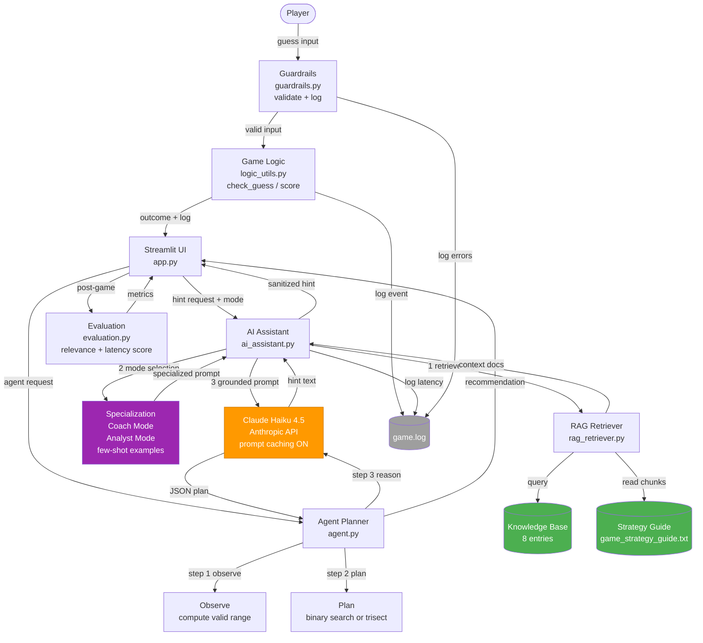

# System Architecture Diagram

## Mermaid.live Code

Copy everything between the triple-backtick fences below and paste it at
https://mermaid.live — then click "Export > PNG" and save as `assets/architecture.png`.

## Architecture Summary

| Layer | Component | Purpose |
|-------|-----------|---------|
| Input | Guardrails | Validate input, block injection, log errors |
| Logic | Game Logic | Bug-fixed check_guess, update_score, parse_guess |
| Retrieval | RAG Retriever | Two sources: structured KB + text file |
| Specialization | AI Assistant | Few-shot Coach/Analyst modes constrain LLM tone |
| Planning | Agent | Observe → Plan → Reason with visible steps |
| Inference | Claude Haiku 4.5 | Shared LLM with prompt caching |
| Output | Streamlit UI | Two-column layout: game + AI panel |
| Reliability | Evaluation + Tests | 44 unit tests + 11 harness tests + live metrics |
