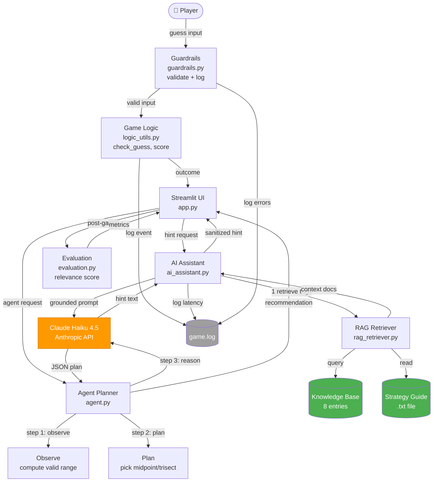

# System Architecture Diagram

Paste the Mermaid code below into https://mermaid.live, then export as PNG
and save as `assets/architecture.png` to embed in your README.

```mermaid
flowchart TD
    Player([👤 Player]) -->|guess input| GR[Guardrails\nguardrails.py\nvalidate + log]
    GR -->|valid input| GL[Game Logic\nlogic_utils.py\ncheck_guess, score]
    GL -->|outcome| UI[Streamlit UI\napp.py]
    UI -->|hint request| AI[AI Assistant\nai_assistant.py]
    UI -->|agent request| AG[Agent Planner\nagent.py]

    AI -->|1 retrieve tags| RAG[RAG Retriever\nrag_retriever.py]
    RAG -->|query| KB1[(Knowledge Base\n8 entries)]
    RAG -->|read| KB2[(Strategy Guide\n.txt file)]
    RAG -->|context docs| AI
    AI -->|grounded prompt| LLM[Claude Haiku 4.5\nAnthropic API]
    LLM -->|hint text| AI
    AI -->|sanitized hint| UI

    AG -->|step 1: observe| OB[Observe\ncompute valid range]
    AG -->|step 2: plan| PL[Plan\npick midpoint/trisect]
    AG -->|step 3: reason| LLM
    LLM -->|JSON plan| AG
    AG -->|recommendation| UI

    GL -->|log event| LOG[(game.log)]
    AI -->|log latency| LOG
    GR -->|log errors| LOG

    UI -->|post-game| EVAL[Evaluation\nevaluation.py\nrelevance score]
    EVAL -->|metrics| UI

    style LLM fill:#ff9900,color:#fff,stroke:#cc7700
    style KB1 fill:#4CAF50,color:#fff
    style KB2 fill:#4CAF50,color:#fff
    style LOG fill:#9E9E9E,color:#fff
```
